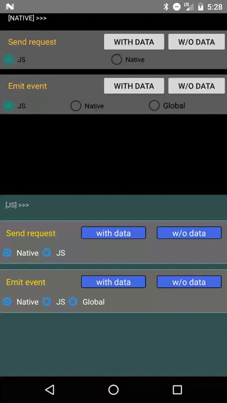

Electrode React Native Bridge Demo App
--------------------------------------

This is the demo/test app of the electrode react native bridge.  
The UI of this demo app is divided in two halves :

- The `top half` of the screen contains the `Native App`.
- The `bottom half` of the screen is the `React Native App`.

Yes, there is actually a native app and a react native app running at the same time on the same screen. This is the easiest way to actually exchange messages while allowing one to see messages being exchanged.

#### If you want to run it yourself

Git clone the top level repo (https://gecgithub01.walmart.com/Electrode-Mobile-Platform/react-native-electrode-bridge), then within this repo, cd into the `example` folder :

```shell
> cd example  
```

the run the following command to install all JS dependencies :

```shell
> npm install
```

Once done, you can run the android application with this command (you need to have an emulator running)

```shell
> react-native run-android
```

#### If you don't really care about running it yourself ...

... Here is what it looks like (I'm sure you can tell UI was designed by a developer !)


